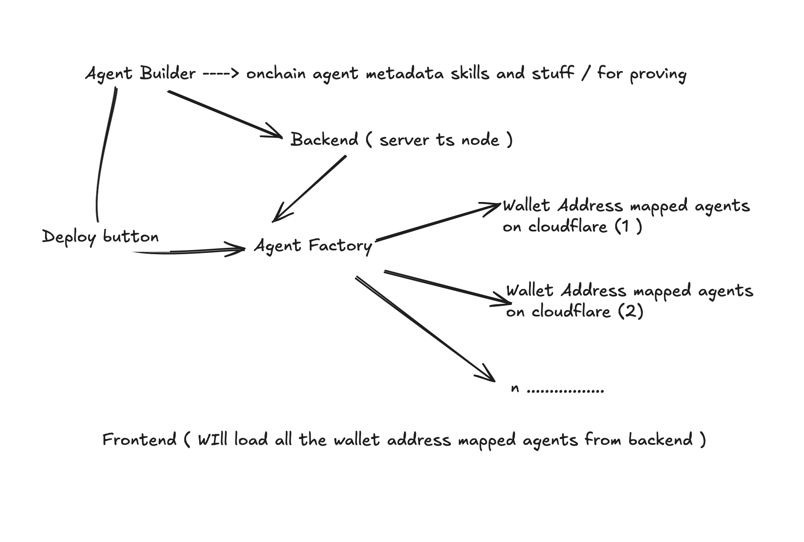

# 402-NadClaw — Implementation Plan & Status

## Architecture Target

```
[ Next.js Frontend (Agent Builder + My Agents) ]
                    |
[ API Routes (Node/TS Server) ]
                    |
[ PostgreSQL (Prisma ORM) ]
                    |
[ AgentFactoryService (Server-Side Orchestrator) ]
                    |
[ Cloudflare Workers API ]
                    |
[ Deployed Agent Runtime (Edge) ]
```

---

## Planned Items & Status

### 1. Database Layer (PostgreSQL + Prisma)

| Item | Status |
|------|--------|
| Install Prisma + pg adapter | DONE |
| Define schema: `users`, `agents`, `deployments` | DONE |
| Enums: `AgentStatus`, `DeploymentStatus` | DONE |
| Run migrations (`npx prisma migrate dev`) | DONE |
| Generate Prisma client to `lib/generated/prisma/` | DONE |
| Prisma singleton with `@prisma/adapter-pg` (`lib/server/db.ts`) | DONE |
| Decode `prisma+postgres://` URL → raw `postgres://` for TCP pool | DONE |

**Files:** `prisma/schema.prisma`, `lib/server/db.ts`

---

### 2. API Routes (CRUD + Deploy)

| Item | Status |
|------|--------|
| `GET /api/agents?wallet=0x...` — List agents by wallet | DONE |
| `POST /api/agents` — Create or update agent (upserts user) | DONE |
| `GET /api/agents/[id]?wallet=0x...` — Get single agent | DONE |
| `PATCH /api/agents/[id]` — Partial update (name, canvas) | DONE |
| `DELETE /api/agents/[id]` — Delete agent | DONE |
| `POST /api/agents/[id]/duplicate` — Clone agent | DONE |
| `POST /api/agents/deploy` — Deploy pipeline (real Cloudflare) | DONE |
| `GET /api/agents/deploy?skills=N` — Legacy x402 payment endpoint | DONE |

**Files:** `app/api/agents/route.ts`, `app/api/agents/[id]/route.ts`, `app/api/agents/[id]/duplicate/route.ts`, `app/api/agents/deploy/route.ts`

---

### 3. Deployment Pipeline

| Item | Status |
|------|--------|
| `DeploymentRunner` — validate → create deployment → deploy → update status | DONE |
| Creates `Deployment` record in DB with logs | DONE |
| Updates `Agent.status` through lifecycle (draft → deploying → live/failed) | DONE |
| Persists `workerUrl` on agent and deployment records | DONE |

**File:** `lib/server/services/deploymentRunner.ts`

---

### 4. Agent Factory (Cloudflare Workers)

| Item | Status |
|------|--------|
| `generateWorkerCode()` — builds complete Worker JS from agent graph | DONE |
| `cloudflareDeployWorker()` — real Cloudflare API upload (ES module multipart) | DONE |
| `mockDeploy()` — fallback when credentials not set | DONE |
| Workers subdomain: `monadclaw.workers.dev` | DONE |
| Worker endpoints: `/health`, `/execute`, `/graph` | DONE |

**File:** `lib/server/services/agentFactory.ts`

---

### 5. Skill Executors (Worker Runtime)

| Skill | Phase | Status |
|-------|-------|--------|
| `api_call` | 1 | DONE — Real HTTP fetch |
| `webhook_notify` | 1 | DONE — Real webhook POST |
| `fetch_price` | 1 | DONE — CoinGecko API |
| `notify_user` | 1 | DONE — Returns notification payload |
| `x402_pay` | 1 | DONE — Returns payment requirement |
| `conditional` | 1 | DONE — Expression evaluation branching |
| `loop` | 1 | DONE — Iteration with interval |
| `store_result` | 1 | DONE — KV store with TTL |
| `mint_token` | 2 | DONE — Stub |
| `mint_nft` | 2 | DONE — Stub |
| `transfer_asset` | 2 | DONE — Stub |
| `create_dao` | 2 | DONE — Stub |
| `send_email` | 2 | DONE — Stub |
| `set_reminder` | 2 | DONE — Stub |
| `create_task` | 2 | DONE — Stub |
| `schedule_meeting` | 2 | DONE — Stub |
| `fetch_states` | 2 | DONE — Stub |
| `fetch_balance` | 2 | DONE — Stub |
| `fetch_transactions` | 2 | DONE — Stub |
| `query_user` | 2 | DONE — Stub |
| `run_sub_agent` | 2 | DONE — Stub |

**Files:** `lib/server/services/skillExecutors.ts`, `lib/server/types/skillExecutor.ts`

---

### 6. Frontend → Backend Wiring

| Item | Status |
|------|--------|
| API client (`lib/api-client.ts`) replaces localStorage | DONE |
| `MyAgentsContent.tsx` reads from DB via API | DONE |
| Agent Builder (`ab/page.tsx`) saves/loads via API | DONE |
| Deploy flow: save → x402 payment → deploy pipeline | DONE |
| Status badges (live/deploying/failed/draft) | DONE |
| Worker URL display on deployed agents | DONE |

**Files:** `lib/api-client.ts`, `app/myagents/MyAgentsContent.tsx`, `app/ab/page.tsx`

---

### 7. Environment & Config

| Item | Status |
|------|--------|
| `.env` — DATABASE_URL, CLOUDFLARE_API_TOKEN, CLOUDFLARE_ACCOUNT_ID | DONE |
| `.env.local` — PAY_TO_ADDRESS, NEXT_PUBLIC_WALLETCONNECT_PROJECT_ID | DONE |
| `.env.example` — Template with all variables documented | DONE |
| `.gitignore` — Excludes secrets, includes `.env.example` | DONE |

---

### 8. x402 Payment Integration

| Item | Status |
|------|--------|
| Network: Monad Testnet (`eip155:10143`) | DONE |
| Token: USDC at `0x534b2f3A21130d7a60830c2Df862319e593943A3` | DONE |
| Facilitator: `https://x402-facilitator.molandak.org` | DONE |
| Price: `0.1 USDC` per unique skill type | DONE |
| Config: `402/x402-config.ts` | DONE |

---

### 9. Documentation

| Item | Status |
|------|--------|
| `Usage.md` — Full usage guide | DONE |
| `plan.md` — This file | DONE |

---

## Verification

- Build: `npx next build` passes clean
- Dev server: runs at `http://localhost:3000`
- DB: PostgreSQL via `npx prisma dev --detach`
- Agents: Created, listed, deployed via API
- Workers: Live at `https://agent-{id}.monadclaw.workers.dev`
- Endpoints: `/health` returns agent info, `/execute` runs graph, `/graph` returns metadata

---

## Summary

**All 9 planned sections are fully implemented.** The system supports end-to-end agent creation, persistence, real Cloudflare Workers deployment, and wallet-mapped agent management through the x402 micropayment protocol on Monad Testnet.
